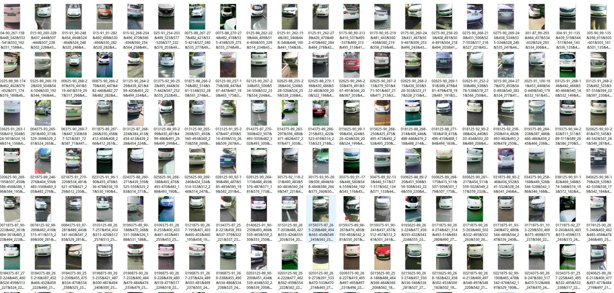
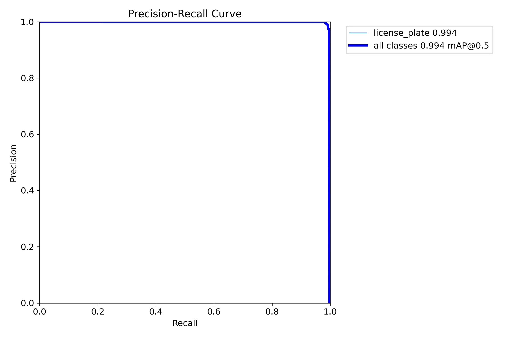
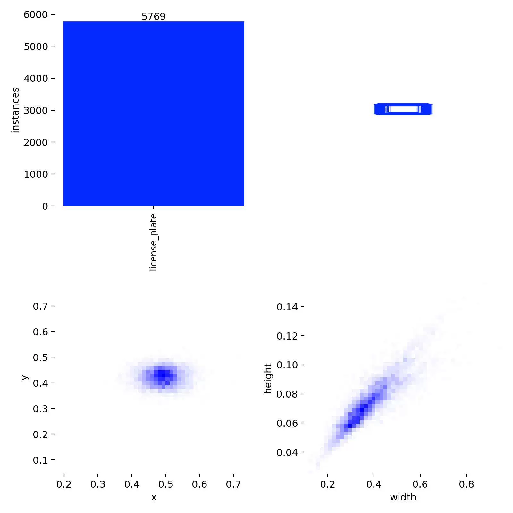
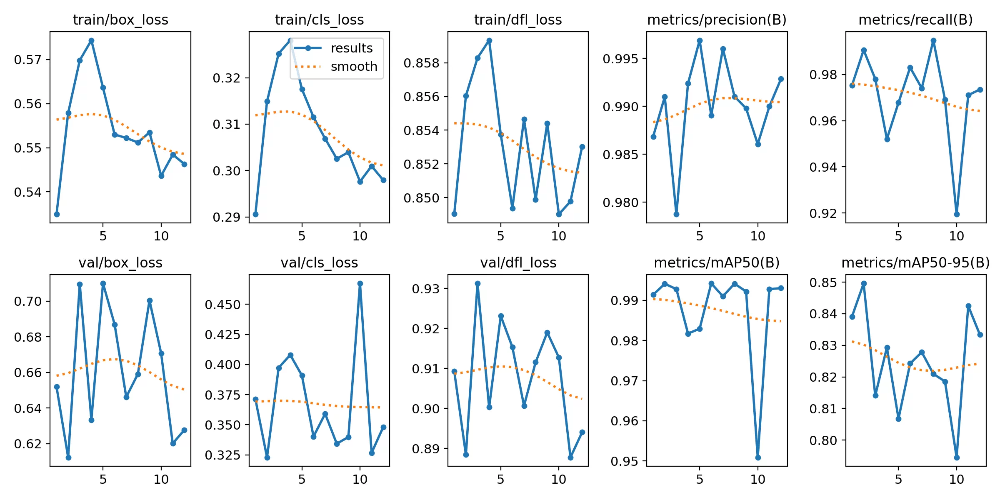
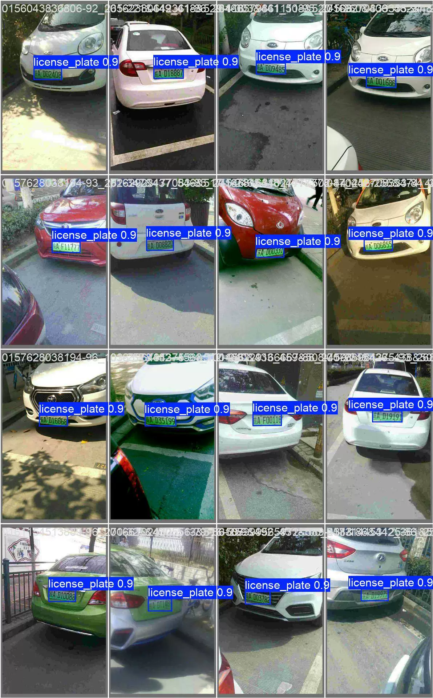
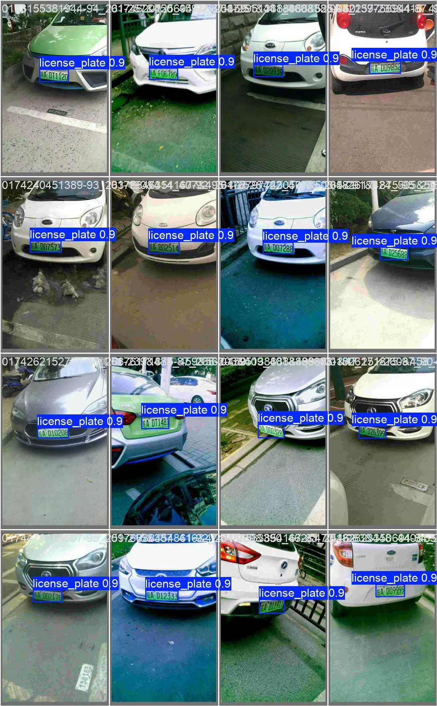
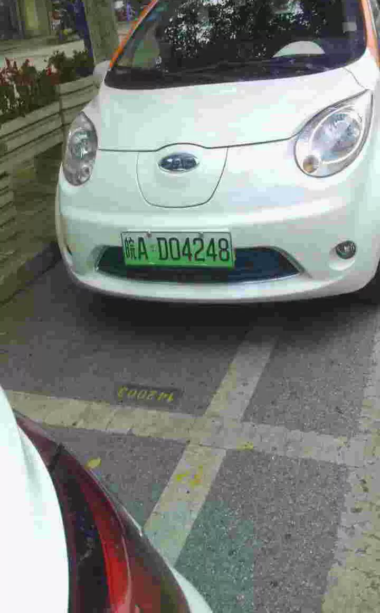
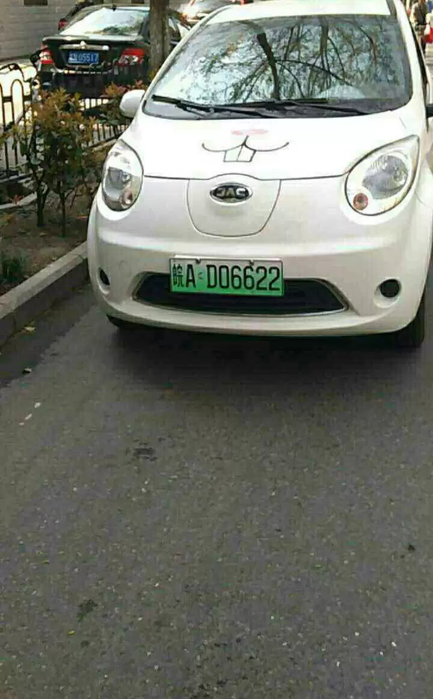

## Body

New Energy Vehicle License Plate Target Detection Dataset in YOLO format

Totally 12,276 images, labeled with tags and already divided into YOLO format: train (5,769), valid (1,001), test (5,506).

It is divided into one class, namely: license_plate, which represents the license plate.

The source dataset is CCPD dataset, converted to YOLO format for training.

YOLOv8s target detection weight file (Training rounds 100, pre-trained model YOLOv8s.pt, mAP@0.5 0.994) along with the training results file.

Electronic virtual products are not returnable upon sale.

## Images

Here is a pay link on Stripe ( https://buy.stripe.com/3cs8yP7sY87d0vu9AB ). Please contact me lonlonago@foxmail.com after funding $89, and I will send you a complete data files , thank you!

